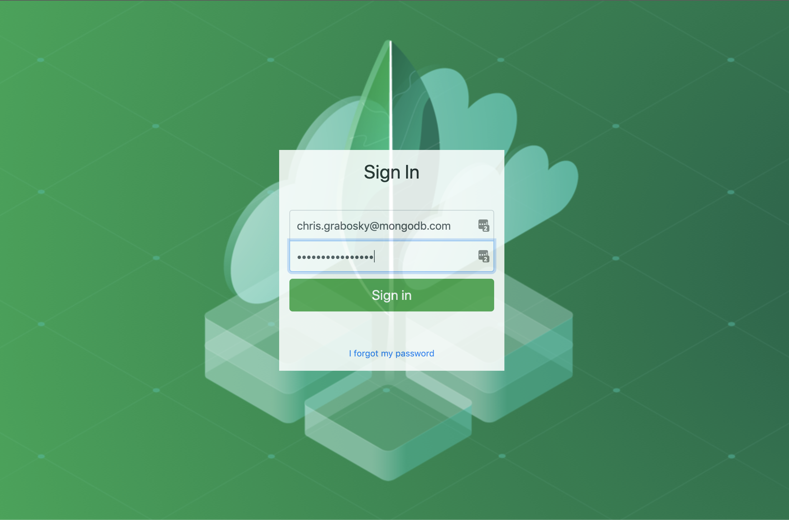
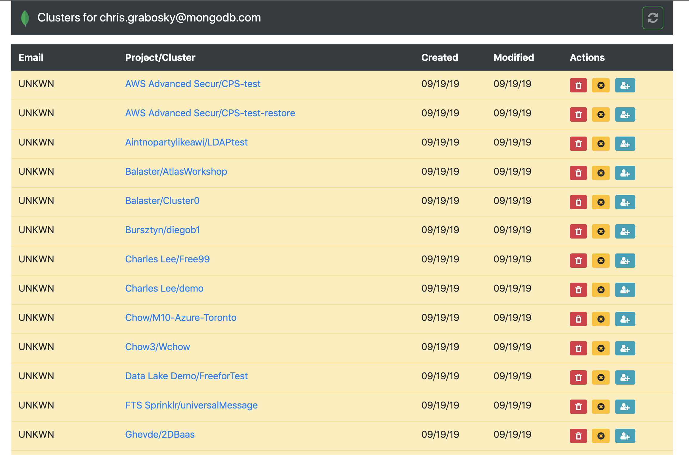
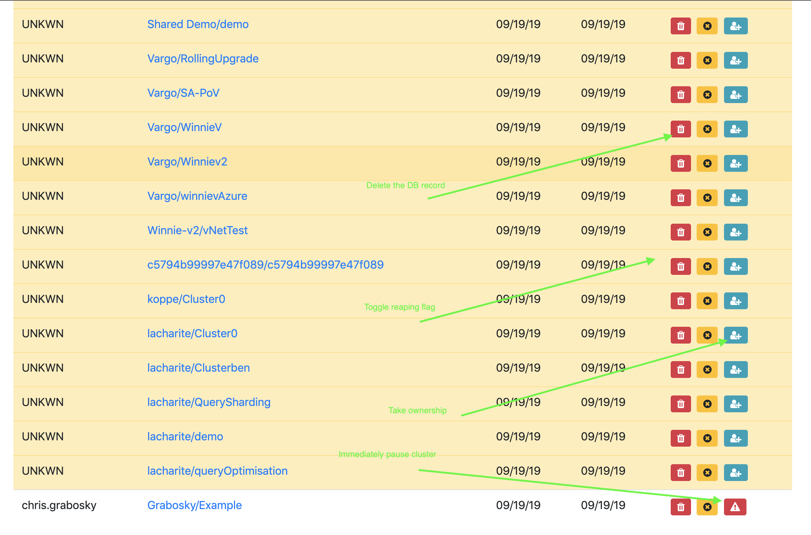
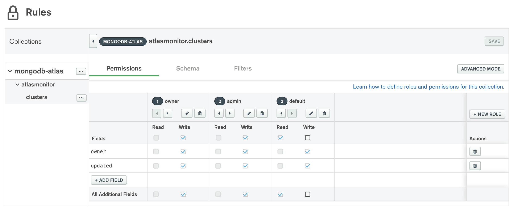

# Atlas Monitor

## Background
This is a utility that crawls a specific MongoDB Atlas Org, enters all of that log data into a MongoDB Atlas cluster, which triggers events to parse that. Regular cron jobs then look at that parsed data to see which clusters should be "reaped" or "paused" based on user input.

There is a simple UI to power that.

## Screenshots

The UI is labeled:
* Top Bar:
   * Refresh button at top pulls new clusters it finds from Atlas API
   * The chart icon will take you to the charts page
   * Clicking the person icon will reveal a drop down that allows you to set your phone number and scroll down to your clusters
* Actions column (right most column in table):
   * The clock will toggle whether the cluster should be auto-reaped. Default is it will be auto reaped (`noReap:false`)
   * The blue person button is visible on unclaimed clusters. This changes the `owner` field to your info
   * the warning triangle button will immediately pause the cluster 
   * If you are an admin (controlled via the `validAdmins` Value array in Stitch) you will see a drop down menu with more options
* Row Color Coding
   * Rows that are white will not be auto realed (`noReap:true`)
   * Rows that are yellow are in a warning state (`noReap:false, warnings:{$lt:3}`)
   * Rows that are red means that cluster will be reaped tomorrow (`noReap:false, warnings:{$gte:3}`)
   * Rows that are black means the cluster is paused (`reaped:true`)
   * Rows that are light blue means that the cluster will be paused on Friday nights and resumed Monday mornings (weekend) (`pausedWeekends:true`)
   * Rows that are green have a manual `protected:true` flag on the document which means they will never be reaped regardless of any other flags and status. You must set this field in the collection manually in Compass or the CLI.
* Status column (second column from the left) icons:
   * Hover over the icons here for the description
   * Group of people - Tenant cluster and cannot be modified via the API
   * Pause - Cluster is paused (`reaped:true`)
   * Thumbs up - cluster will not be reaped (`noReap:true`)
   * Lock - cluster is protected (`protected:true`)
   * Exclamation - warning state (`noReap:false, warnings:{$lt:3}`)
   * Exclamation in triangle - danger state (`noReap:false, warnings:{$gte:3}`)
   * Calendar with dash - pause on weekends (`pausedWeekends:true`)

## Code explanation
### Database
Database used is the `atlasmonitor` database. In it is the `log` collection which gets filled every day with the output of Atlas API calls, triggers run against that to create the `clusters` collection which is used for the UI and business decisions, and if any cluster is paused or deleted, an entry for that API call is made in the `changelog` collection. The `clusters` collection does have a unique index put on  `project:1,name:1` for the project and cluster friendly names.

*NEW FEATURE* is that if the `cluster` document has a field `protected:true` then the cluster will never be reaped. This intentionally cannot be set via the web interface. You must manually set it in the document so that it is a deliberate choice. You should do this on the cluster running the reaper for self preservation.

### Stitch
In the `Stitch-Export` folder is the export of the stitch app that uses the following code:

* `generateDailyUserLog` is called daily at 2 am to poll the org logs, iterate over every project, find all clusters, and put that data as one document in the `log` collection
* `updateMasterList` is called on insert of the `log` collection to iterate over each of the found clusters and insert them into `clusters` with basic meta data. That collection has a unique index
* `ageYesterday` gets called daily at 1 am to increment the `warnings` field in the `cluster` document for all documents with `noReap:false` (or other words, not protected)
* `reap` is called on update of the `clusters` collection and if the `warnings` exceeds 2, it will pause the cluster. _NOTE THAT THIS LOGIC IS COMMENTED OUT RIGHT NOW FOR ONBOARDING PURPOSES_
* `pauseCluster` is called by the above `reap` function when it should pause a cluster
* `isValidAdmin` is a function which tracks which user IDs are admin

Authentication is done with email/password auth within Stitch.

An HTTP Service called `hook` is done to make the http calls to the Atlas API.

Rules are set up so:
* the `owner` can insert/delete `{"owner.id": "%%user.id"}`
* the `admin` can modify `{"%%true": {"%function": {"name": "isValidAdmin", "arguments": [ "%%user"]}}}`
* the `default` can view or take ownerhsip `{}`

Secrets are:
* `validAdmins` is a `string[]` of Admin UIDs
* `orgID` is the Atlas Org's GUID
* `atlasAPI` is an object with the scoped API keys: `{"key": "name","secret": "abc-def-ghi-123-456"}

Hosting is enabled and the `Stitch-Hosting` directory is uploaded there.

### HTML
In the `Stitch-Hosting` folder is the HTML files which:

* `index.html` is the login page
* `clusters.html` uses Query Anywhere to build a list from the `clusters` collection and lets you modify the `noReap` flag to prevent reaping or pause the cluster right there by calling `reap` Stitch function
* `conf/conf.js` holds global constants 
* The `reset.html`, `signup.html`, `emailregistration.html` handle new user sign ups for Stitch Authentication